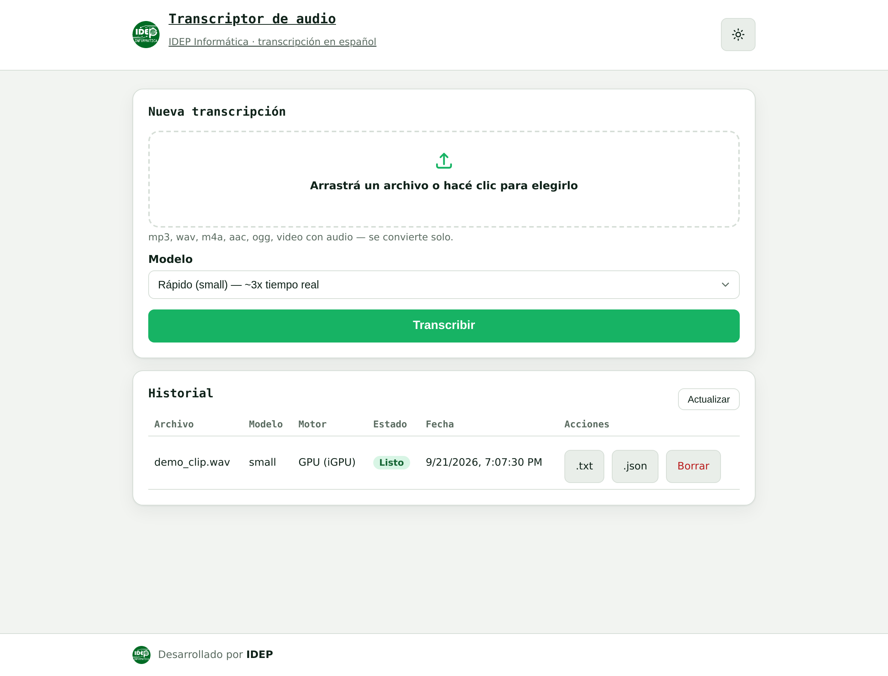

# whisper-app

Frontend propio de transcripción de audio/video en español, con motor
[whisper.cpp](https://github.com/ggml-org/whisper.cpp) acelerado por GPU
(Intel iGPU vía OpenVINO) en un segundo servidor. Pensado para reuniones
largas (30-40+ minutos), donde una API síncrona clásica se topa con timeouts
de proxies, tuneles y clientes HTTP.

## Características

- **Cola de trabajos asíncrona**: subís el archivo y el servidor responde al
  instante con un `id` de trabajo. Ninguna conexión HTTP queda abierta
  durante los minutos que dura la transcripción — así se evita cualquier
  timeout de proxy/CDN/cliente.
- **Progreso real, no estimado**: se lee directamente la salida de
  `whisper-cli --print-progress` en el motor remoto, no un cálculo por
  tiempo transcurrido.
- **Selección de modelo**: `small` (rápido, ~3x tiempo real) o `medium`
  (más preciso, mejor con cruces de voces, ~5x más lento).
- **Idioma fijado a español**: el motor siempre transcribe forzando
  `-l es`, para que no haga auto-detección de idioma en audios con ruido o
  tramos poco claros.
- **Indicador de motor de cómputo (GPU/CPU)**: cada trabajo terminado
  muestra si corrió acelerado por iGPU o si cayó a CPU (fallback silencioso
  de OpenVINO), leyendo los propios logs de whisper.cpp.
- **Descarga de resultados**: botones para bajar la transcripción en
  `.txt` o `.json` (con segmentos y timestamps), tanto en el resultado
  recién generado como desde el historial.
- **Historial persistente**: todos los trabajos (archivo, modelo, motor,
  estado, fecha, duración) quedan en SQLite y sobreviven reinicios del
  contenedor.
- **Un solo trabajo a la vez**: el motor remoto tiene una sola iGPU
  compartida — la cola nunca corre dos transcripciones en paralelo.
- **Cancelar y borrar**: cualquier trabajo (en cola o corriendo) se puede
  cancelar, y cualquier trabajo terminado se puede borrar del historial
  (elimina también sus archivos). Como el estado vive en el servidor, se ve
  y se puede accionar desde cualquier sesión/dispositivo que abra la página,
  no solo desde donde se subió el audio.
- **Recuperación ante caídas**: si el contenedor se reinicia con un trabajo
  a medio camino, ese trabajo queda marcado `failed` en vez de colgado
  para siempre; no hay reintentos automáticos.
- **Identidad IDEP**: desarrollado por [IDEP Informática](https://www.idepba.com.ar/idep-informatica/).

## Interfaz

Frontend propio sin dependencias de build ni CDN (HTML/CSS/JS plano,
servido directo desde `src/public/`). Tema claro/oscuro conmutable desde
el header (la preferencia se guarda en `localStorage`), interfaz
responsiva — el historial pasa a tarjetas apiladas en celular — y
estética IDEP (paleta del flyer `#enredATE'26`, logo y favicon propios).

## Captura de pantalla



## Arquitectura

```
Usuario (navegador) ──HTTPS──▶ reverse proxy (auth) ──▶ whisper-app (Node/Express + SQLite)
                                                                │
                                                       SSH (usuario restringido,
                                                       comando forzado, sin shell)
                                                                ▼
                                                     motor whisper.cpp + iGPU (OpenVINO)
```

- La app **no hace ninguna autenticación propia** — se delega por completo
  al reverse proxy que la expone a internet (usuario/contraseña vía Access
  List, Basic Auth, o lo que corresponda). No exponer este puerto
  directamente a internet sin ese proxy delante.
- La conversión de formato (mp3/m4a/video/etc. → WAV 16kHz mono) ocurre acá,
  con `ffmpeg`, antes de mandar el audio al motor. El motor remoto solo
  recibe WAV limpio.
- La comunicación con el motor es por SSH con una clave restringida a un
  puñado de comandos fijos (`MKJOBDIR`, `RUNJOB`, `KILLJOB`, `CLEANJOB`,
  transferencia de archivos vía `rsync`/`rrsync`) — nunca una shell
  interactiva.

## Ciclo de vida de un trabajo

`queued → converting → uploading → transcribing → done | failed`

## Variables de entorno

Ver [`.env.example`](.env.example). Copiarlo a `.env` y completar con los
valores reales del entorno (host del motor, usuario/clave SSH, etc.) — ese
archivo **no se versiona** (está en `.gitignore`).

| Variable           | Descripción                                             |
|--------------------|----------------------------------------------------------|
| `PORT`             | Puerto interno de la app dentro del contenedor.          |
| `BIND_HOST`        | IP/host donde `docker compose` publica el puerto.        |
| `DB_PATH`          | Ruta del archivo SQLite (dentro del contenedor).         |
| `UPLOADS_DIR`      | Directorio de staging de subidas (dentro del contenedor).|
| `CT110_HOST`       | Host del motor whisper.cpp.                              |
| `SSH_USER`         | Usuario SSH restringido en el motor.                     |
| `SSH_KEY_PATH`     | Clave privada SSH (montada read-only vía `secrets/`).    |
| `KNOWN_HOSTS_PATH` | `known_hosts` pre-sembrado del motor.                    |
| `MAX_UPLOAD_MB`    | Límite de tamaño de archivo subido.                      |
| `MAX_JOB_MINUTES`  | Timeout duro por trabajo de transcripción.                |

## Puesta en marcha

```bash
cp .env.example .env    # completar con los valores reales
mkdir -p secrets
# copiar ahí la clave privada SSH y el known_hosts del motor:
#   secrets/id_ed25519
#   secrets/known_hosts
chmod 600 secrets/id_ed25519

docker compose up -d --build
```

Requiere que, del lado del motor whisper.cpp, exista un usuario de sistema
restringido con comando SSH forzado (`MKJOBDIR`/`RUNJOB`/`KILLJOB`/
`CLEANJOB`, más `rsync --server` vía `rrsync`). Ese script y su
configuración viven en el servidor del motor, fuera de este repo.

## API

- `POST /api/jobs` — multipart (`audio`, `model`) → `201 {id, status}`.
- `GET /api/jobs?limit=&offset=` — historial.
- `GET /api/jobs/:id` — estado/progreso de un trabajo (para polling).
- `GET /api/jobs/:id/result?format=txt|json` — descarga del resultado
  (`409` si el trabajo no terminó).
- `POST /api/jobs/:id/cancel` — cancela un trabajo en cola o en curso
  (`409` si ya terminó). El estado pasa a `cancelled` de forma asíncrona,
  apenas el proceso que se está matando termina de salir.
- `DELETE /api/jobs/:id` — borra un trabajo del historial (si estaba activo,
  se cancela primero) y elimina sus archivos locales.
- `GET /api/health` — healthcheck.

## Despliegue

Ver [`CHANGELOG.md`](CHANGELOG.md) para el historial de versiones.
